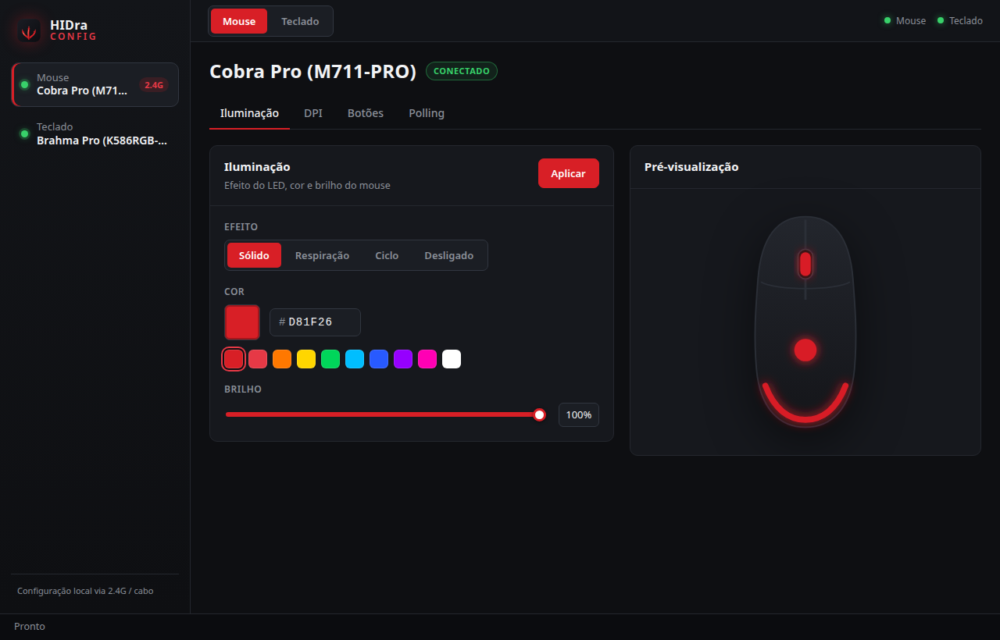
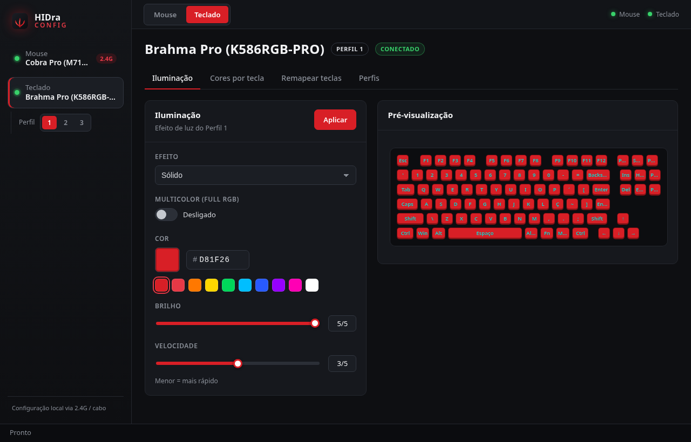
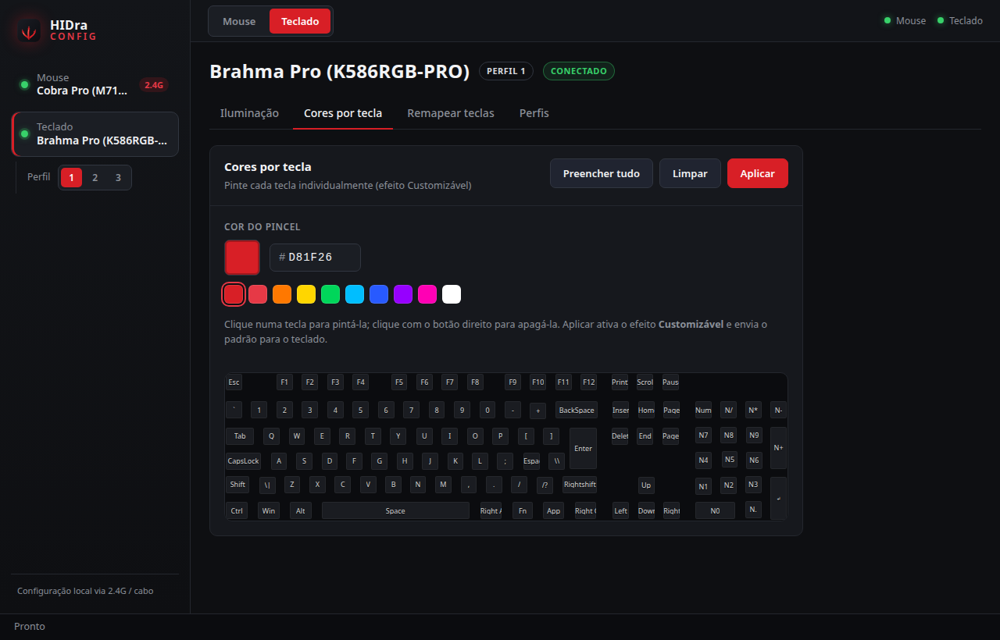

<h1 align="center">HIDra</h1>

<p align="center">
  Configure mouses e teclados gamer no <b>Linux, Windows e macOS</b> — falando
  direto com o hardware por HID, sem depender do programa do fabricante.
</p>

<p align="center"><a href="README.md">Read in English 🇬🇧</a></p>

---

Os fabricantes só publicam o programa de configuração para Windows, um programa
por produto, e param de atualizar. O HIDra é um app só, que fala o protocolo USB
dos próprios aparelhos — sua iluminação, DPI e remapeamento continuam
funcionando independente do sistema que você usa.

> Não é afiliado, endossado nem patrocinado por nenhum fabricante. Os nomes de
> produtos aparecem apenas para dizer qual hardware é compatível.

## Telas

| Mouse | Teclado |
| --- | --- |
|  |  |

Cores por tecla, pintadas uma a uma e gravadas no próprio teclado:



## Dispositivos compatíveis

| Dispositivo | ID USB | Situação | Recursos |
| --- | --- | --- | --- |
| Redragon Cobra Pro / M711-PRO (receptor 2.4 GHz) | `25A7:FA07` | ✅ validado | iluminação, DPI, botões, polling |
| Redragon Cobra Pro / M711-PRO (cabo) | `25A7:FA08` | ✅ validado | iluminação, DPI, botões, polling |
| Redragon Brahma Pro / K586RGB-PRO | `0C45:5004` | ✅ validado | 18 efeitos + cor por tecla, 3 perfis, remapeamento |

**Seu aparelho não está aí?** Muitos periféricos são o mesmo hardware com outro
nome e falam exatamente o mesmo protocolo — adicionar costuma ser **uma linha**
em [`src-tauri/src/devices.rs`](src-tauri/src/devices.rs). Veja
[docs/ADDING-DEVICES.md](docs/ADDING-DEVICES.md) ou abra um
[pedido de dispositivo](https://github.com/luizjr/HIDra/issues/new?template=device-request.yml)
com a saída do `lsusb`.

## Instalação

Baixe o instalador do seu sistema na
[última release](https://github.com/luizjr/HIDra/releases/latest).

### Linux — `.deb`, `.rpm` ou AppImage

```sh
sudo dpkg -i HIDra_*_amd64.deb        # Debian / Ubuntu / Mint / Pop!_OS
sudo rpm -i HIDra-*.x86_64.rpm        # Fedora / openSUSE
chmod +x HIDra_*.AppImage && ./HIDra_*.AppImage
```

O executável se chama `hidra`, então o app também abre pelo terminal com esse
nome.

O `.deb` e o `.rpm` já instalam a regra udev — basta **reconectar o aparelho**
(ou o dongle) depois de instalar. Com o AppImage, ou rodando do código-fonte,
instale a regra uma vez:

```sh
sudo sh packaging/install-udev.sh          # --uninstall reverte
```

A regra usa `uaccess`, que entrega os nós `hidraw` a quem está logado na sessão
local — sem root, sem setuid e sem nada rodando em segundo plano.

### Windows — `.exe`

Rode o instalador `.exe`. Ele não é assinado digitalmente, então o SmartScreen
mostra "O Windows protegeu o seu PC": clique em **Mais informações → Executar
assim mesmo**. Não precisa de driver.

### macOS — `.dmg`

Abra o `.dmg` e arraste o HIDra para Aplicativos. Como não é notarizado, a
primeira abertura precisa de **clique direito → Abrir**, ou:

```sh
xattr -dr com.apple.quarantine /Applications/HIDra.app
```

> As versões de Windows e macOS saem do CI, mas foram muito menos testadas que a
> de Linux. Se algo não funcionar,
> [abra uma issue](https://github.com/luizjr/HIDra/issues/new/choose).

### Versões de desenvolvimento

Todo push na `main` recompila os três instaladores e substitui a
[pré-release `nightly`](https://github.com/luizjr/HIDra/releases/tag/nightly).
Use-a para testar uma correção antes de virar versão; fora isso, use a
[última release](https://github.com/luizjr/HIDra/releases/latest).

## O que ele faz

**Mouses (família Cobra Pro)**
- Iluminação: sólido, respiração, ciclo, desligado — cor, brilho e velocidade
- DPI: 5 estágios com X/Y independentes, cor por estágio, indicador de estágio
- Botões: remapear os 8 — clique do mouse, DPI ±/ciclo, tecla, combo (Ctrl+C),
  multimídia, disparo (fire), liga/desliga RGB, trocar polling
- Taxa de polling: 125 / 250 / 500 / 1000 Hz
- Leitura do que está realmente gravado no aparelho

**Teclados (família Brahma Pro)**
- 18 efeitos de iluminação + **cor por tecla** (Customizável)
- Cor, brilho (0–5), velocidade (1–5), direção e modo multicolor (Full RGB)
- 3 perfis independentes gravados no teclado, trocados pelo app
- Remapear teclas: tecla única, modificador, multimídia, desativar — e restaurar
  o mapa de fábrica

Tudo fica gravado no próprio aparelho: continua valendo depois de fechar o app,
reiniciar ou levar o periférico para outra máquina.

## Compilando

Requisitos: [Rust](https://rustup.rs) ≥ 1.77, Node.js ≥ 18 e as dependências do
Tauri ([lista oficial](https://tauri.app/start/prerequisites/)). No
Debian/Ubuntu:

```sh
sudo apt install libwebkit2gtk-4.1-dev libudev-dev build-essential curl file \
                 libxdo-dev libssl-dev libayatana-appindicator3-dev librsvg2-dev
```

```sh
npm install
npm run tauri dev      # abre o app em modo desenvolvimento
npm run tauri build    # instaladores em src-tauri/target/release/bundle
```

## Problemas comuns

**Linux: retângulos pretos por cima da janela.** O WebKitGTK coloca elementos
com filtro numa camada composta separada e, em algumas configurações de GPU
(híbrido Intel + NVIDIA no Wayland, visto no WebKitGTK 2.52), desenha essa
camada no lugar errado. Por isso o HIDra não usa nenhum filtro CSS ou SVG. Se
mesmo assim acontecer — aqui ou em outro app Tauri — a saída bruta é
`WEBKIT_DISABLE_COMPOSITING_MODE=1 hidra`, que desliga a composição por GPU.

**Um ajuste não "pega" no mouse sem fio.** O rádio 2.4 GHz dorme quando o mouse
está parado. Mexa no mouse enquanto clica em *Aplicar*, ou use o cabo.

**O aparelho aparece como desconectado no Linux.** Falta a regra udev, ou o
aparelho não foi reconectado depois de instalá-la: `sudo sh
packaging/install-udev.sh` a partir do código-fonte (o `.deb`/`.rpm` já trazem a
regra), e então desconecte e reconecte.


## Como funciona

O app é [Tauri](https://tauri.app): backend em Rust que faz toda a conversa com
o hardware e interface em React/TypeScript. Não há serviço em segundo plano nem
módulo de kernel — o backend abre a coleção HID do fabricante com
[`hidapi`](https://github.com/libusb/hidapi) e escreve os mesmos pacotes que o
programa oficial escreve.

```
src/                    interface React (um painel por tipo de aparelho)
src-tauri/src/
  devices.rs            tabela de dispositivos compatíveis  ← adicione o seu aqui
  hid.rs                descoberta + transporte, escolha de endpoint por sistema
  mouse.rs              protocolo Compx de 17 bytes
  keyboard.rs           protocolo SONiX de 64 bytes
PROTOCOL.md             notas byte a byte dos dois protocolos
```

O protocolo do teclado foi obtido capturando o tráfego USB do programa oficial
do Windows; cada byte está anotado em [`PROTOCOL.md`](PROTOCOL.md) para que
ninguém precise refazer esse trabalho.

## Contribuindo

Relatos de bug, novos dispositivos, capturas de protocolo e melhorias de
interface são todos bem-vindos — veja [CONTRIBUTING.md](CONTRIBUTING.md). A
contribuição mais valiosa é um dispositivo novo:
[docs/ADDING-DEVICES.md](docs/ADDING-DEVICES.md) mostra o caminho.

## Créditos

- Protocolo do mouse: [`open-m711pro`](https://github.com/mateusands/open-m711pro),
  [`m913-ctl`](https://github.com/Qehbr/m913-ctl) e
  [`mouse_m908`](https://github.com/dokutan/mouse_m908) — todos GPL.
- Protocolo do teclado: capturado do programa oficial, com referência ao
  [`rgb_keyboard`](https://github.com/dokutan/rgb_keyboard) e à comunidade
  OpenRGB.

## Licença

[GPL-3.0-or-later](LICENSE). Use por sua conta e risco: todo painel tem um botão
**Restaurar padrão**, e nada aqui grava firmware.
